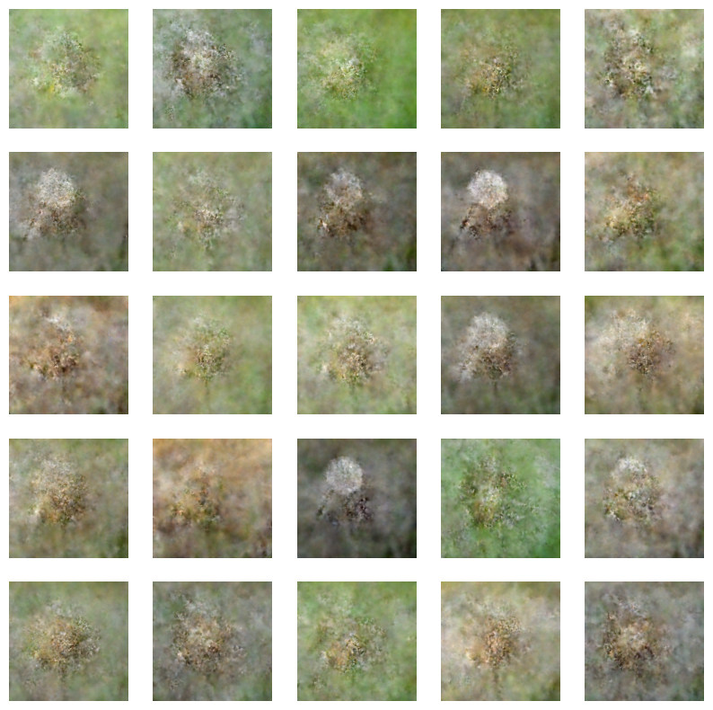

## Simple diffusion model to generate dandelion pictures

The model was trained on 323 pictures of dandelions from Kaggle flower dataset. Here are the generated pictures from the diffusion network after ~20 epochs. 

The training took ~4 days.

The jupyter notebook "predictions" displays generated pictures after every epoch. It would not display the generated pictures for the final epoch on a webpage, but refer to final epoch generated pictures above.